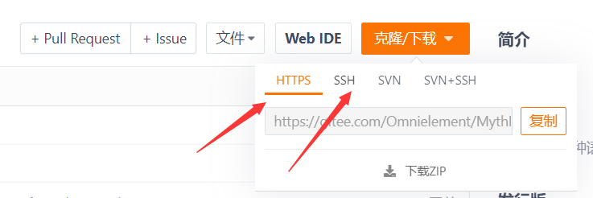
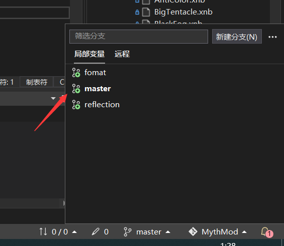
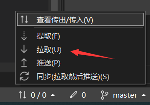
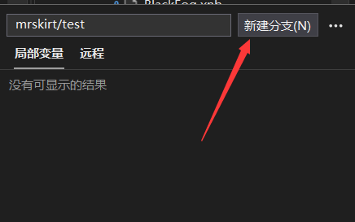
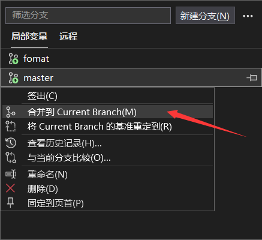
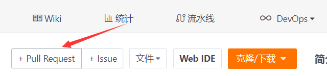
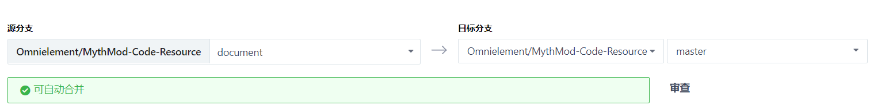
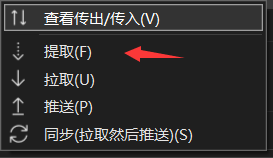

# 目录 <!-- omit in toc -->
- [如何获取源码](#如何获取源码)
  - [Clone源码](#clone源码)
- [多人协作](#多人协作)
  - [分支保护](#分支保护)
  - [创建分支](#创建分支)
  - [提交PR](#提交pr)
  - [删除分支](#删除分支)
  - [提取远程分支](#提取远程分支)
  - [其他](#其他)
- [FAQ](#faq)
# 如何获取源码
我们的代码仓库地址是：https://gitee.com/Omnielement/MythMod-Code-Resource

## Clone源码


本仓库支持 Https 和 SSH 地址，可以直接使用 VS 克隆或者在命令行中输入
```
git clone https://gitee.com/Omnielement/MythMod-Code-Resource.git
```
来克隆到当前目录。克隆完成后记得将文件夹名字重命名为 `MythMod` 。

# 多人协作
## 分支保护
本代码仓库已经进行了 master 分支保护，这意味着主分支不允许直接 push。如果需要上传修改，请使用自己的分支，并且通过提交 Pull Request 来将更改合并到 master。

## 创建分支
一般来说，我们的修改都是在 master 分支的基础上进行。在创建分支前，请确保自己本地的 master 分支已经是最新的，我们可以用
```
git checkout master
git pull origin master
```
来拉取最新的 master 分支更改。你也可以在 VS 中操作，我们只要点击右下方的分支栏，然后点击 master 分支



然后在这里直接拉取更改



之后我们可以从 master 分支分出来一个分支，使用指令
```
git checkout master
git branch -b <你的分支名字>
```
来创建一个和 master 更改一致的新分支。如果你使用的是VS，那么只需要在输入框输入分支名字，然后点击新建分支即可。



## 提交PR
在提交 Pull Request 之前，先要确保自己的分治能够无冲突的合并到 master 分支。推荐在 push 之前再次更新本地的 master 分支并且使用命令
```
git merge master
```
如果在 VS 里操作，则可以在另一个非主分支选择 master 分支，并且合并到 Current Branch。



以上操作会将 master 的最新更改合并到自己的分支上。如果 master 分支的新增更改和自己的分支有冲突，那么就需要在 VS 里解决冲突。如果没有冲突那么 merge 操作结束后就能直接把更改应用到 master 分支了。

要创建 Pull Request ，可以直接在网页版上操作



直接选择你的修改所在的分支作为原分支，目标分支选择 master



之后填写 PR 的标题、说明，然后创建 Pull Request 就好了。

目前我们 PR 合并的策略是：需要一个非本人的开发者审查，如果通过即可合并到 master。

> 💡开发分支的时候建议多 merge master 的更改，以防将所有的冲突都留到最后解决。同时 master 的更改也会包括其他开发者的更改，以便于及时调整开发策略。


## 删除分支
当 PR 合并到 master 以后可以选择删除当前分支，或者不删除留着方便以后追查。

如果需要删除分支，可以使用指令
```
git branch -d <分支名字>
```
这个指令会在删除前检查merge状态，如果没有完全 merge 进 master 那么会给一个警告并且终止删除流程。如果仍然要删除可以使用
```
git branch -D <分支名字>
```

以上操作同样也可以在 VS 里进行，这里不再多赘述。需要注意的是这两个指令都是删除本地的分治，如果需要删除远程分支可以在网页版或者 VS 上操作，或者使用指令
```
git push origin --delete <远程分支名>
```

## 提取远程分支
有时候其他开发者可能创建了其他远程分支，但是在你的本地并没有这些分支。此时我们就需要用到 Git 的提取操作来将远程分支同步到本地
```
git fetch origin <分支名称>
```
在 VS 里是这个功能



或者用
```
git fetch --all
```

来获取所有分支的更改。注意，`git fetch` 操作不会在当前分支应用这些更改，这是它和 `git pull` 的重要区别。

## 其他
Gitee 上还有一些自带功能的Git说明文档，可以参考这个链接：https://gitee.com/help/articles/4192#article-header0

本文档也会根据需求更新。

如果遇到 Git 操作的问题可以直接问 @mrskirt

# FAQ
待填充...