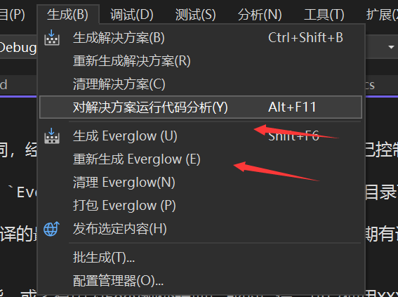
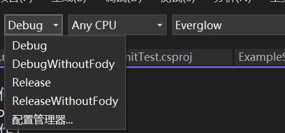

# 源代码编译手册

## 基本流程
与通常的Mod编译方式不同，经过 PR#15 以后我们将项目的编译设置为自己控制，而不是依赖于TML。测试时只要启动VS的生成即可自动编译，加载也可以像之前一样在游戏内加载，不过再此之前必须先build来生成dll。

如果遇到无法加载预编译 `Everglow.dll` 之类的报错信息就是因为源码目录下没有编译好的 `Everglow.dll`。此时从VS编译即可。

测试之前要确保VS已经编译的最新版本的Everglow.dll，否则结果会与预期有误差。

## 可选项
如果不需要Profiler功能，或者有因为Fody预处理而造成的错误，可以使用XXXWithoutFody配置编译，此时不会再应用后处理流程。

## 参考PR
1. 【#15】 https://gitee.com/mrskirt/everglow/pulls/15