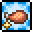
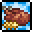

# EverGlow原版食物系统重置<!-- omit in toc -->

众所周知，原版泰拉瑞亚拥有相当多的食物，食物来源也五花八门，但一共也就提供四种buff：

吃得好
+ 2 防御、+ 2％ 所有伤害暴击率（召唤伤害除外）+ 5％ 近战速度和挖矿速度+ 5％ 所有伤害（包括召唤伤害）+ 50% 仆从击退+ 20％ 移动速度

很满意
+ 3 防御、+ 3％ 所有伤害暴击率（召唤伤害除外）+ 7.5％ 近战速度、+10%挖矿速度+ 7.5％ 所有伤害（包括召唤伤害）+ 75% 仆从击退+ 30％ 移动速度

饭饱酒足
+ 4 防御、+ 4％ 所有伤害暴击率（召唤伤害除外）+ 10％ 近战速度、+15%挖矿速度+ 10％ 所有伤害（包括召唤伤害）+ 100% 仆从击退+ 30％ 移动速度

酿跄
防御力 -4、 近战攻击暴击率 +2%、近战攻击速度和伤害 +10%）

> 💡所以就是觉得不合适用4种buff来敷衍，某些食物的持续时间高达48分钟，根本就浪费（要知道泰拉人的平均寿命只有15分钟）。因此我们做出了对原版食物系统进行重置的决定。
#食物系统
      整个食物系统分为两个版块，即饥渴状态以及食物buff的重置
##饥渴状态
     我将原版食物分为两大类：食物与饮料。食物提供较长时间的加成，每次吃下食物后玩家会得到增益，饱食度也会相应地增加，直到达到最大饱食度，玩家便不可再次进食。饮料提供短时间大幅加成，使玩家获得短时间爆发输出或暂时苟命的机会，每次喝下饮料后玩家会得到增益，渴觉状态从渴变为不渴，玩家便不可再次喝下饮料。
      最大饱食度（int）初始值设置为50，暂时没有能够提升或减少它的消耗品或饰品，也许后续会加入。
      饱食度（int）设定为每30秒减1，暂时没有能够提升或减少其削减速率的消耗品或饰品，也许后续会加入。饱食度可以通过血糖检测仪显示

      渴觉状态（bool）设定为每5分钟从不渴变为渴，暂时没有能够提升或减少其变化速率的消耗品或饰品，也许后续会加入。渴觉状态可以通过渗透压检测仪显示。

      两者能够与个人数字助手和魔镜进一步合成手机（这一配方可能后续会改），手机继承两者能力。

##食物buff重置
     以下即为全新的食物buff：https://docs.qq.com/sheet/DWk9SRnlTYkFVQ1JU?u=af275c1119bd47ac94f338cdec1601bd&tab=BB08J5

任务
■ 1、人物饱食度和渴觉状态 √
■ 2、饱食度计时器和渴觉状态计时器 √
■ 3、信息显示 √
■ 4、信息对应合成表 √
■ 5、饥渴状态保留 √
■ 6、食物buff重置 √
■ 7、食物提供的饱食度 √
■ 8、平衡
■ 9、翻译

